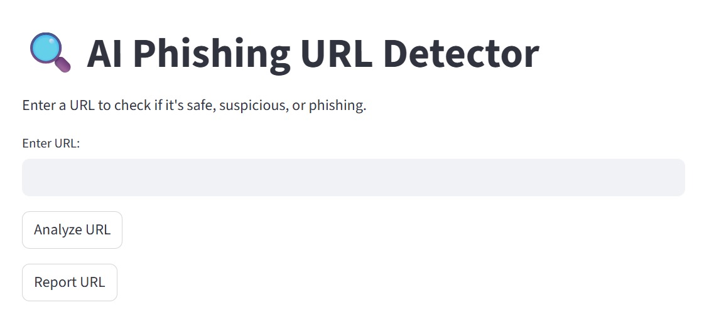
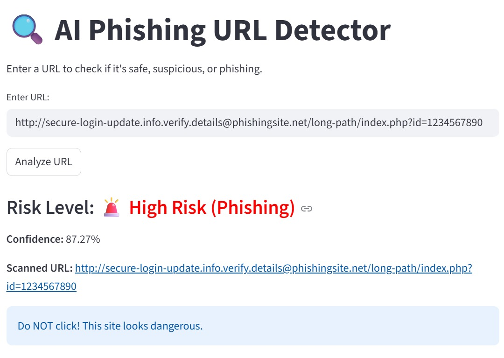
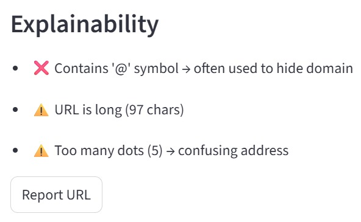
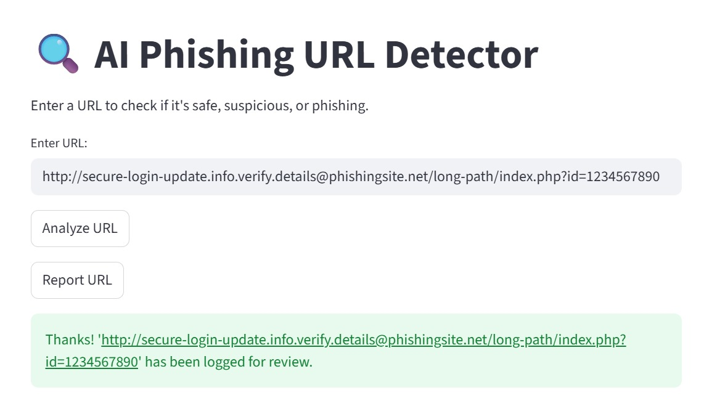

# 🛡️ Phishing URL Detector App

An interactive Phishing URL Detection Web App built using **Streamlit, Scikit-learn, Pandas, NumPy, and Joblib**.
This app analyzes a user-entered URL and classifies it as **Safe, Suspicious, or Phishing, with an explainability breakdown to help users understand why a URL was flagged**.


# 🚀 Live App

🔗 [Click here to use the live app](https://phishing-detector-68kaodtt9pmnrtb8x9gjrs.streamlit.app/)


## ✨ Features

✔ 🔍 AI Phishing URL Detector — Enter a URL to check if it's **Safe, Suspicious, or Phishing**.

✔ Real-time prediction with a **confidence score**.

✔ **Explainability section** showing why a URL was flagged (e.g., contains @, too long, too many dots).

✔ Clean and simple Streamlit interface.

✔ Displays clear **safety warnings and recommendations** (e.g., “❌ Do NOT click”).

✔ Option to **report URLs for review**.


## 🖥️ Demo Screenshots 

  
  




## ⚡ Getting Started

### 1️⃣ Clone the Repository

```bash
git clone https://github.com/Hemalytica/phishing-url-detector.git
cd phishing-url-detector

2️⃣ Set Up a Virtual Environment (Optional, but Recommended)

python -m venv venv
source venv/bin/activate  # On Windows: venv\Scripts\activate

3️⃣ Install Dependencies

pip install -r requirements.txt

4️⃣ Run the Application

streamlit run app.py

The app will open in your browser automatically! 🎉

📂 Project Structure
📦 phishing-url-detector
┣ 📜 app.py               # Main Streamlit application
┣ 📂 assets/              # Screenshots and demo images
┣ 📜 model.pkl            # Trained ML model (saved using Joblib)
┣ 📜 requirements.txt     # Python dependencies
┣ 📜 README.md            # Project documentation

🚀 Future Enhancements

✅ Add bulk URL analysis from text/CSV files.
✅ Deploy as a browser extension for real-time protection.
✅ Integrate real-time threat intelligence APIs.
✅ Add richer visualizations for URL scan statistics.

📜 License

This project is open-source under the MIT License.
Check the LICENSE file for more details.

📌 Uploading to GitHub
After adding your README.md, push it to GitHub:

git add README.md
git commit -m "Added README file"
git push origin main
Now, your README will be live on your GitHub repository! 🎉

🛠️ Tech Stack
Frontend: Streamlit
Backend: Python, Scikit-learn
Libraries: Pandas, NumPy, Joblib
Input Data: User-entered URLs
